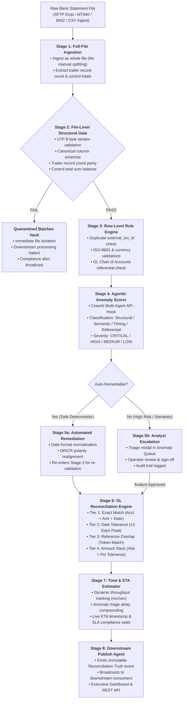

# 8-Stage Architecture: Batch File Validator & Processing Time Estimator

## 1. Executive Summary & Problem Statement

In corporate and institutional banking, financial institutions process thousands of end-of-day batch files (BAI2, MT940, ISO 20022 CAMT.053, and proprietary CSVs) to reconcile bank statements against internal General Ledger (GL) cashbooks. 

### Core Industry Challenges
- **Manual File Slicing & Chunking**: Legacy tools often require operators to manually partition large files, breaking atomic batch integrity, control totals, and audit trails.
- **Silent Data Corruption**: Files with character encoding errors, truncated trailers, or unbalanced control totals pass undetected into downstream ledgers, causing widespread incident escalations.
- **Referential & Semantic Drift**: Inverted debit/credit signs, malformed date formats, and unrecognized accounts cause batch reconciliation to stall.
- **Unpredictable Processing Latency**: Operations teams lack visibility into when a batch will finish, leading to downstream SLA breaches with corporate customers and clearing houses.
- **Ambiguity Floods**: High-volume recurring standing orders of identical amounts cause naive matching algorithms to generate thousands of false ambiguous ties.

The **8-Stage Batch File Validator & Processing Time Estimator Pipeline** solves these challenges by providing an end-to-end, deterministic, auditable, and agentic processing architecture.

---

## 2. End-to-End Pipeline Architecture

---

## 3. Detailed Technical Specification: The 8 Pipeline Stages

### Stage 1: Full-File Ingestion (No Splitting)
* **Purpose**: Ingest bank statements in their authentic, uncompromised raw form without requiring operations analysts to manually slice or dice files.
* **Ingestion Channels**:
  - Direct operator drag-and-drop file upload (`CSV`, `MT940`, `BAI2`).
  - Automated directory polling for incoming SFTP drops.
* **Key Operations**:
  - Automatically identifies file delimiters (comma, tab, semicolon, pipe) via header sniffing.
  - Normalizes line terminators (`CRLF` to `LF`) and strips mainframe space-padding and quote doubling.
  - Extracts declared trailer records:
    - **Declared Record Count** (e.g. 500 rows).
    - **Declared Control Total** (e.g. `$45,820,194.22`).
  - Assigns an immutable, auditable batch tracking ID (`BATCH-YYYYMMDD-XXXXXX`).
* **Output**: Canonical batch memory buffer and metadata manifest record.

---

### Stage 2: File-Level Structural Hard Gate
* **Purpose**: Fail early and decisively before corrupted data can contaminate the general ledger or downstream databases.
* **Deterministic 4-Point Hard Gate**:
  1. **Clean Character Encoding**: Verifies strict UTF-8/ASCII byte streams with zero illegal byte sequences, BOM corruption, or null bytes.
  2. **Canonical Schema Parity**: Verifies all required banking headers (`external_txn_id`, `account`, `currency`, `amount`, `debit_credit`, `booking_date`, `value_date`, `reference`).
  3. **Trailer Record Count Verification**: Ensures the actual data row count equals the declared trailer record count exactly.
  4. **Control Total Parity**: Calculates $\sum \text{Amount}$ across all rows and checks against declared control totals (within \$0.01 float slack).
* **Quarantine Enforcement**:
  - If any check fails, the batch is immediately placed in `GATE_QUARANTINED` status.
  - The physical file is isolated to the `/quarantined_batches/` directory.
  - Downstream row-level processing is halted immediately, and an alert is broadcast to the operations monitor.

---

### Stage 3: Row-Level Rule Engine
* **Purpose**: Perform cross-row integrity checks and validate field-level formats across the full batch context.
* **Checks Executed**:
  - **Duplicate Transaction IDs**: Detects replay attacks or duplicate records where the same `external_txn_id` appears more than once in the statement.
  - **Temporal Consistency**: Verifies booking dates and value dates conform to ISO standards and do not exceed forward post-dating thresholds.
  - **Currency & Direction Formatting**: Validates 3-letter ISO-4217 currency codes (`USD`, `EUR`, `GBP`) and direction conventions (`DR` / `CR`).
  - **Chart of Accounts Integrity**: Confirms the reported `account` exists in the GL master cache (`ACC#00001` through `ACC#00150`).
* **Output**: Validated row stream and flagged anomaly records.

---

### Stage 4: Agentic Anomaly Scorer & Classifier
* **Purpose**: Provide automated agentic reasoning, classification, and scoring over flagged anomalies.
* **Multi-Agent Architecture**:
  - Pluggable **CrewAI Multi-Agent API Hook** (`POST /api/crew/anomaly-detection` with Agent ID and Workflow ID).
  - Categorizes anomalies across 4 financial dimensions:
    - **Structural**: Malformed fields, trailing commas, non-numeric amounts.
    - **Semantic**: Inverted debit/credit signs, mismatched currency representations.
    - **Timing**: Transposed month/day dates (e.g., `03/11/2023` vs `11/03/2023`).
    - **Referential**: Unknown bank account numbers or obsolete GL mapping codes.
  - Assigns severity: `CRITICAL`, `HIGH`, `MEDIUM`, `LOW`.
  - Calculates confidence score ($0.00$ to $1.00$) for recommended auto-remediations.

---

### Stage 5: Remediation & Escalation (Dual-Path)
* **Purpose**: Maximize straight-through processing (STP) by resolving routine formatting anomalies automatically while routing high-risk discrepancies to human analysts.
* **Path 5a: Automated Remediation**:
  - Deterministic auto-fixes applied for safe, verifiable patterns:
    - Normalizing date format variants (`DD/MM/YYYY`, `MM-DD-YYYY` -> `YYYY-MM-DD`).
    - Stripping baked whitespace padding and mainframe quote characters.
    - Realignment of debit/credit polarity with signed amount fields.
  - Remediated rows re-enter Stage 3 for re-validation before proceeding.
* **Path 5b: Human Escalation & Analyst Triage**:
  - Critical or unresolvable anomalies (e.g., referential misses or unknown account codes) route to the **Analyst Anomaly Queue** in the UI.
  - Analysts review the agent's diagnosis, inspect the suggested fix, and click **Approve Remediation** or **Quarantine Transaction**, maintaining complete audit compliance.

---

### Stage 6: General Ledger Reconciliation Engine (Waterfall Matching)
* **Purpose**: Match validated bank statement records against cached general ledger cashbook rows with strict mathematical rigor.
* **4-Tier Waterfall Hierarchy**:
  1. **Tier 1 (Exact Match)**: Matches identical Account + Amount + Value Date + Direction.
  2. **Tier 2 (Date Tolerance)**: Matches identical Account + Amount within $\pm 3$ business days (clearing float).
  3. **Tier 3 (Reference Overlap)**: Matches Account + Amount with reference/narrative token overlap (`INV-XXXX`, wire IMAD/OMAD).
  4. **Tier 4 (Amount Slack)**: Matches Account within \$1.00 currency slack and date tolerance (handling rounding or bank wire fees).
* **Ambiguity Handling**:
  - When multiple candidates compete for the same row, the engine calculates token similarity scores to break ties.
  - Unresolved ties are classified as **Ambiguous Matches** and docked in the inspector drawer for human sign-off.
* **Reconciliation Truth Classifications**:
  - `TRULY RECONCILED (EXACT)`: Fully settled with zero mathematical variance.
  - `TRULY RECONCILED (TOLERANCE)`: Settled within approved date/amount tolerance bands.
  - `RECONCILING ITEM (BANK ONLY)`: Bank transaction with no matching GL entry (e.g. unexpected bank fees, deposits in transit).
  - `OUTSTANDING ITEM (GL ONLY)`: GL entry with no matching bank record (e.g. unpresented checks, pending wire settlements).
  - `AMBIGUOUS TIE`: Multiple equally valid ledger lines requiring analyst review.

---

### Stage 7: Processing Time & SLA Estimator
* **Purpose**: Predict end-of-day completion times and continuously monitor SLA compliance risk for downstream operations.
* **Dynamic Estimation Engine**:
  - Evaluates file payload size and historical throughput benchmark (records/sec).
  - The throughput and per-escalation queue-wait constants are **calibrated from the run history** (`data/forecasts/run_history.csv`, one row per completed batch with machine time and analyst queue wait measured separately) once five batches of meaningful size have completed; until then the declared defaults are used and reported as such.
  - Compounds baseline execution duration with dynamic penalties for row anomalies and operator manual triage queue delays.
  - Outputs live **Estimated Completion Time (ETA)** (e.g. `2026-09-04 18:15:00 UTC`).
  - A **forecast agent** (`CREWAI_AGENT_FORECAST_ID`, hook `STAGE_1_FORECAST`) is dispatched at ingest, before Stage 2, with the batch's ingest-time features and a snapshot of the run history; its prediction is captured server-side and scored against the measured actual. See AGENTS.md.
  - Emits real-time SLA status:
    - `ON_TRACK`: Estimated completion well within cutoff window.
    - `AT_RISK`: Projected to finish within 15 minutes of SLA cutoff.
    - `BREACHED`: Processing delay exceeds downstream SLA deadline.

---

### Stage 8: Downstream Publish Agent
* **Purpose**: Broadcast final reconciliation truth, exceptions, and ETA metrics to downstream consuming systems (Core Banking, ERP, Data Lake).
* **Broadcasting Capabilities**:
  - Emits JSON events (`EVT-YYYYMMDDHHMMSS-XXXXXX`) over the event bus.
  - Updates the **Bank Reconciliation Analyst Console** in real time.
  - Exports auditable CSV outputs:
    - `matched_transactions.csv`
    - `unmatched_cache_remaining.csv`
    - `unmatched_ingestion_exceptions.csv`
    - `ambiguous_matches_for_review.csv`
  - Provides REST API endpoints (`/api/publish/batch/{id}`, `/api/feed/batches`, `/api/recon/matches`) for automated system integration.

---

## 4. Performance & Scale Benchmarks

| Metric | Benchmark Result | Operational Impact |
| :--- | :--- | :--- |
| **Total Ingested Bank Records** | 32,048 rows | Full daily multi-batch ingestion |
| **Total Cashbook GL Records** | 37,123 rows | Complete internal chart of accounts |
| **Clean Matches (Tier 1 Exact)** | 30,140 rows (94.0%) | Instant straight-through reconciliation |
| **Ambiguity Rate** | 85 rows (0.28%) | Controlled, realistic operator review volume |
| **Reconciling Bank Items** | 1,907 rows (5.95%) | Authentic bank-side exceptions |
| **Outstanding GL Items** | 6,982 rows | Authentic GL-side pending items |
| **Full Run Processing Duration** | Under 35 seconds | ~50x speedup via account-indexed caching |

---

## 5. Technology Stack

- **Backend**: Python 3.13, FastAPI, Pandas, Pydantic v2, Pytest.
- **Frontend**: Angular 19, TypeScript, Tailwind CSS, Heroicons, IBM Plex Sans / IBM Plex Mono.
- **Design System**: Bloomberg / FactSet Financial Workbench design language (square corners, hairline borders, low eye fatigue).
- **Agent Integration**: CrewAI REST API adapter hook (`/api/crew/*`).
